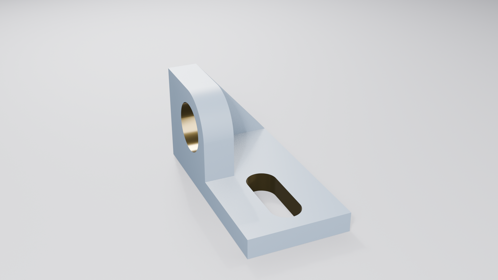

# aula_05 — Modelagem 3D com agentes

Laboratório da Aula 05: a mesma peça modelada em um programa **B-Rep paramétrico** a
partir de um desenho técnico, e depois apresentada no **Blender**, com material,
iluminação e imagem. A mesma cota é alterada nos dois, e a comparação entre os dois
esforços é a entrega.

> **A Tarefa A foi feita no FreeCAD 1.1.3, não no Fusion 360.** O Fusion não tem versão
> para Linux e o seu servidor MCP sobe junto com o programa, o que torna os dois caminhos
> previstos na apostila (seções 4.3 e 4.7) inexecutáveis nesta máquina. O motivo, as
> alternativas examinadas, o que a troca preserva e o que ela custa estão em
> **[`substituicao-fusion-por-freecad.md`](substituicao-fusion-por-freecad.md)**.

## A peça

Suporte em L do desenho [`desenho-tecnico-suporte.pdf`](desenho-tecnico-suporte.pdf)
(*Exercise-71*): base 100 × 50 × 10 mm vazada por um rasgo oblongo R7,5 com os centros dos
arcos afastados 25 mm; parede de 15 mm de espessura, 50 mm de comprimento e 40 mm de
altura, com canto superior arredondado em R20 e furo passante Ø25 concêntrico com esse
arco; e nervura triangular de reforço de 35 × 40 mm com 10 mm de espessura, perpendicular
à parede. Volume 72.832,1 mm³.

| | |
|---|---|
|  |  |
| Tarefa B — furo Ø25 | Passo 10 — o mesmo furo alterado na malha |

## Arquitetura montada

```
OPENCODE --stdio--> freecad-mcp 0.1.22 --XML-RPC 9875--> FREECAD 1.1.3  (complemento FreeCADMCP)
OPENCODE --stdio--> blender-mcp 1.0.2  --socket  9876--> BLENDER 5.2.1  (complemento MCP oficial)
OPENCODE --HTTP---> fusion 27182                                        desabilitado
```

## Os arquivos

| Arquivo | O que é |
|---|---|
| `opencode.json` | os servidores MCP; o `fusion` fica com `"enabled": false` |
| `AGENTS.md` | unidades, convenções e regras do projeto |
| `desenho-tecnico-suporte.pdf` | o desenho técnico, insumo da Tarefa A |
| `leitura-do-desenho.md` | a tabela de leitura, cota por cota, com a vista de origem |
| `comparacao.md` | **a Entrega 2** — medição de contexto, as duas alterações e a conclusão |
| `substituicao-fusion-por-freecad.md` | por que o FreeCAD no lugar do Fusion |
| `medir-contexto.py` | mede o custo de contexto de um servidor MCP |
| `suporte.FCStd` | o modelo paramétrico, com o histórico das 12 operações |
| `suporte.blend` | a cena do Blender: malha, dois materiais, três luzes e câmera |
| `saidas/` | `suporte.step` e `suporte.stl` (Ø25) e as versões `-furo30` |
| `capturas/` | o viewport de cada uma das seis etapas, mais os passos 7 e 8 |
| `modelagem/` | os scripts que o agente executou, na ordem — reprodutíveis |
| `renders/` | as duas imagens em 1920×1080 |

## Reproduzir

```bash
python3 -m venv .venv && source .venv/bin/activate
pip install "git+https://projects.blender.org/lab/blender_mcp.git#subdirectory=mcp"
pip install freecad-mcp
opencode mcp list      # com o Blender e o FreeCAD abertos
```

O complemento do Blender exige **"Allow Online Access"** ligado em Preferências → Sistema;
sem isso a porta 9876 nunca abre e não há mensagem de erro. O do FreeCAD vai em
`~/.local/share/FreeCAD/Mod/FreeCADMCP`, e o autostart é gravado em
`~/.local/share/FreeCAD/freecad_mcp_settings.json`.
